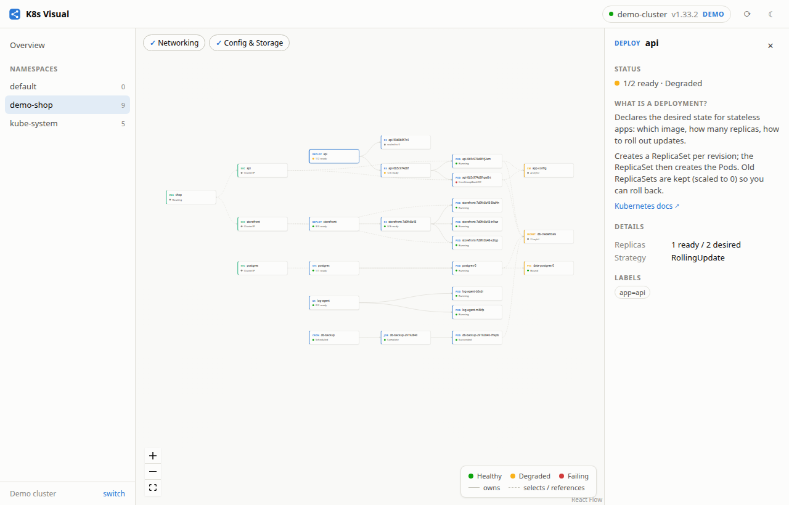

<div align="center">


# K8s Visual

**See your Kubernetes cluster as a living diagram.**

A lightweight, open-source desktop app that makes the architecture and
hierarchy of Kubernetes visible — and understandable.


<picture>
  <source media="(prefers-color-scheme: dark)" srcset="docs/screenshot-dark.png">
  
</picture>

</div>

## Why

Kubernetes is hard to learn because its architecture is invisible. `kubectl`
shows you flat lists — but the mental model that actually matters is a
hierarchy: a **Deployment** creates **ReplicaSets**, ReplicaSets run **Pods**,
**Services** find those Pods by labels, and an **Ingress** routes traffic to
Services.

K8s Visual draws that hierarchy as a live graph. Every arrow is a real
relationship read from the cluster — ownership, label selection, or an
explicit reference. Click any resource and the app explains what that kind
*is* and where it sits in the hierarchy, with a link to the official docs.

## Features

- **Live hierarchy graph** per namespace: Ingress → Service → workload
  controllers → Pods → ConfigMaps / Secrets / PersistentVolumeClaims
- **Cluster overview**: nodes, namespaces, versions, capacity — the top of
  the hierarchy
- **Built-in learning mode**: every resource comes with a plain-language
  explanation of what it is and what owns it
- **Demo cluster included** — explore a realistic sample deployment
  (including a crash-looping Pod and an old ReplicaSet revision) with **no
  cluster and no setup at all**
- **Health at a glance**: colorblind-safe status colors, always paired with
  text
- **Light & dark mode**, minimalist UI, no clutter
- **Light on resources**: native system webview via Tauri — a few MB to
  download, a fraction of an Electron app's memory
- **Strictly read-only**: the app never mutates cluster state, and Secret
  *values* are never read — only names and key counts

## Install (Linux)

Download the latest **AppImage** (works on any distro), **.deb**, or
**.rpm** from the [Releases page](../../releases).

```sh
# AppImage: make it executable and run
chmod +x K8s.Visual_*.AppImage
./K8s.Visual_*.AppImage
```

No Kubernetes tooling is required to try it — hit **“Explore the demo
cluster”** on the welcome screen. To connect to a real cluster, the app reads
the standard kubeconfig (`~/.kube/config` or `$KUBECONFIG`), with the same
auth kubectl uses (client certs, tokens, exec plugins) — powered by
[kube-rs](https://kube.rs).

> Windows and macOS builds are on the roadmap; the codebase is
> cross-platform by construction (Tauri), Linux is simply first.

## Build from source

Prerequisites: [Rust](https://rustup.rs), Node.js ≥ 20, and the Tauri Linux
system libraries:

```sh
# Debian/Ubuntu
sudo apt install libwebkit2gtk-4.1-dev build-essential curl wget file \
  libxdo-dev libssl-dev libayatana-appindicator3-dev librsvg2-dev
```

```sh
npm install
npm run tauri dev      # run in development
npm run tauri build    # produce AppImage/deb/rpm in src-tauri/target/release/bundle
```

The frontend alone also runs in a plain browser (demo mode only):
`npm run dev`, then open `http://localhost:5173/?demo`.

## How it works

```
┌────────────────────────────┐     ┌──────────────────────────────┐
│  Frontend (React + TS)     │ IPC │  Backend (Rust, Tauri)       │
│  graph building & layout,  │◄───►│  kube-rs client, kubeconfig  │
│  React Flow rendering      │     │  auth, resource summaries    │
└────────────────────────────┘     └──────────────────────────────┘
```

- `src-tauri/core/` — a plain Rust crate (no UI deps) that connects via
  kubeconfig and condenses resources into small summaries
- `src/graph/` — turns summaries into a graph: **owns** edges from
  `ownerReferences`, **selects** edges from Service label selectors, and
  **references** edges (Ingress → Service, Pod → ConfigMap/Secret/PVC),
  laid out in hierarchy columns
- `src/providers/` — one interface, two sources: the live Tauri backend or
  the built-in demo cluster

The graph polls every 4 seconds; watch-based streaming is on the roadmap.

## Roadmap

- [ ] Watch API streams instead of polling
- [ ] Events and rollout history on the details panel
- [ ] Pod logs viewer
- [ ] Collapse/expand for very large namespaces
- [ ] Node → Pod placement view
- [ ] Windows and macOS builds, Flatpak/AUR packaging
- [ ] Multi-cluster side-by-side

## Contributing

Contributions are very welcome — see [CONTRIBUTING.md](CONTRIBUTING.md).
Good first issues: a new resource kind (HPA, NetworkPolicy, ...), a
translation of the learning blurbs, or a packaging target.

## License

[MIT](LICENSE)
