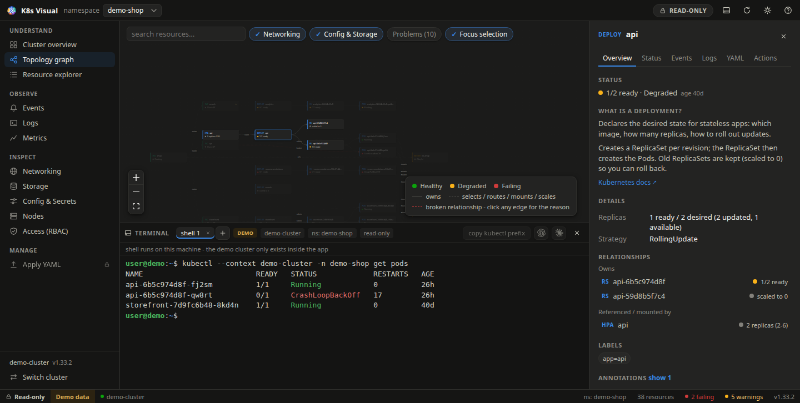

<div align="center">


# K8s Visual

**See your Kubernetes cluster as a living diagram.**

K8s Visual is an open-source Kubernetes desktop app for visually exploring,
debugging, and managing clusters - with a built-in terminal and optional AI
CLI integration.




</div>

## What it is

K8s Visual turns common kubectl workflows into interactive views: topology
graphs, resource details, logs, events, metrics, YAML inspection, and safe
management actions. Instead of hiding Kubernetes behind buttons, K8s Visual
shows what each resource is, how it is connected, and what will change before
an action is applied.

Kubernetes is hard to learn because its architecture is invisible. `kubectl`
shows you flat lists - but the mental model that actually matters is a
hierarchy: a **Deployment** creates **ReplicaSets**, ReplicaSets run **Pods**,
**Services** find those Pods by labels, and an **Ingress** routes traffic to
Services. K8s Visual draws that hierarchy as a live graph where every arrow is
a real relationship read from the cluster - and every operation shows you the
equivalent `kubectl` command, so using the app teaches you the CLI too.

## Connect to anything

Three ways in, one Kubernetes model:

- **Demo cluster** - no setup, no cluster. A realistic sample deployment with
  a crash-looping Pod, an image-pull failure, a Service with no endpoints,
  and a rollback-ready old revision. Management actions work against it, so
  you can practice safely.
- **Local / existing kubeconfig** - `~/.kube/config` or `$KUBECONFIG`, with
  the same auth kubectl uses (client certs, tokens, exec plugins), powered by
  [kube-rs](https://kube.rs). k3s, minikube, kind, and manually configured
  clusters all work, with context switching built in.
- **Managed cloud clusters** - guided connect for **Amazon EKS**, **Azure
  AKS**, and **Google GKE**. The app drives your own already-authenticated
  CLI (`aws` / `az` / `gcloud`) to discover clusters and import a kubeconfig
  entry, shows every CLI command before it runs, and never sees or stores
  cloud credentials. After import, the normal kubeconfig path takes over -
  and the active platform stays visible in the UI, including in every action
  confirmation.

## Features

### Understand
- **Live topology graph** per namespace: Ingress → Service → workload
  controllers → Pods → ConfigMaps / Secrets / PVCs → PVs → StorageClasses,
  plus HPAs and NetworkPolicies
- **Explainable edges** - click any arrow to see *why* the relationship exists
  (the exact selector, ownerReference, or field behind it)
- **Broken relationships made visible**: references to missing resources show
  as ghost nodes; Services with no ready endpoints are flagged on the spot
- **Resource explorer** - the visual `kubectl get`: filterable, sortable
  tables for every kind, with jump-to-graph
- **Built-in learning mode**: every kind comes with what it is, where it sits
  in the hierarchy, and what usually goes wrong with it

### Observe
- **Logs** - follow mode, previous container logs, container selection,
  workload-level aggregation across pods, search and error highlighting
- **Events timeline** - warnings first, grouped counts, jump from an event to
  the resource it involves
- **Metrics** (`kubectl top`) - node capacity meters, pod and workload usage
  with short-term trends collected while the app runs; if metrics-server is
  missing the app says so instead of faking numbers
- **Debugging helpers** for CrashLoopBackOff, ImagePullBackOff, Pending pods,
  and Services without endpoints

### Manage - read-only by default
- **Management mode** is an explicit toggle; every session starts read-only
- Scale, rollout restart, pause/resume, rollback (with rollout history),
  delete, CronJob suspend/trigger, node cordon/uncordon
- **Every action shows**: the target context, namespace and platform, the
  current state, what will change, a risk level, and the equivalent kubectl
  command - destructive actions require typing the resource name
- **YAML** view for every resource, plus edit → diff → server dry-run → apply,
  and an Apply YAML view for pasted/opened manifests (server-side apply)
- **Port-forwarding** with a tunnel manager, and one-shot **exec** into
  containers
- **Secrets stay secret**: names and key names only, values require an
  explicit confirmed reveal, are never stored, and are masked in YAML
- **RBAC-aware**: actions are checked with `SelfSubjectAccessReview`, denied
  operations explain the missing verb and resource, and the Access view shows
  your whole permission matrix

### Terminal & AI (optional, power users)
- **Integrated terminal** (Ctrl+`) - your real shell in a PTY with tabs,
  GPU-accelerated rendering, and full TUI support (`top`, `htop`, alternate
  screen, resize). The header always shows the active platform, context,
  namespace, and app mode; the kubeconfig current-context is never switched
  behind your back
- **Best-effort guard rail**: dangerous kubectl commands (delete namespace /
  PV / PVC / secret, `--force`, drain, apply, edit) are held at Enter - a
  confirmation in management mode, blocked with a hint in read-only mode.
  The shell itself is never restricted; this is a guard, not a sandbox
- **AI CLI integration** - if [Claude Code](https://claude.com/claude-code)
  or Codex CLI is installed, open it in the terminal or ask it about the
  selected resource. Prompts are **sanitized** (identity, status, conditions,
  diagnostics - never Secret values, annotations, tokens, or kubeconfig
  contents), **typed into the shell but never auto-executed**, and log
  excerpts pass through credential redaction first

## Safety model

K8s Visual starts in **read-only mode** by default.

Cluster-changing actions are optional, explicit, and designed around safe
workflows: preview before apply, clear risk labels, namespace/resource/
platform context, confirmation for destructive actions, and RBAC-respecting
access. The goal is not to hide Kubernetes complexity, but to make every
operation visible before it happens.

Privacy follows the same principle:

- no telemetry, no cloud dependency, no data upload
- logs, metrics and secret values go from your cluster to your screen and
  nowhere else
- cloud connect never touches credentials - your own CLI writes the
  kubeconfig entry itself
- AI tools receive nothing automatically; every hand-off is an explicit user
  action with a sanitized, reviewable payload

See [SECURITY.md](SECURITY.md) for the full security policy.

## What K8s Visual is not

K8s Visual is not trying to hide Kubernetes or replace understanding with
buttons.

It is a visual operations layer for Kubernetes: it shows the real resources,
real relationships, real YAML, real logs, real events, and real API actions
behind every operation. If something is unavailable - a missing metrics API,
a missing permission - the app tells you exactly what is missing instead of
pretending.

## Install

**Linux is available today; macOS and Windows builds are in progress.**

Download the latest package from the [Releases page](../../releases):

```sh
# Debian / Ubuntu (.deb)
sudo apt install ./K8s.Visual_1.0.0_amd64.deb

# Fedora / openSUSE / RHEL (.rpm)
sudo dnf install ./K8s.Visual-1.0.0-1.x86_64.rpm

# Any distro (portable AppImage)
chmod +x K8s.Visual_1.0.0_amd64.AppImage
./K8s.Visual_1.0.0_amd64.AppImage
```

No Kubernetes tooling is required to try it - hit **"Explore the demo
cluster"** on the welcome screen.

### System requirements

- 64-bit Linux with WebKitGTK 4.1 + GTK 3 (Ubuntu 22.04+, Debian 12+,
  Fedora 36+, Arch, openSUSE); Wayland or X11
- ~12 MiB installed (deb/rpm), ~360 MiB RAM in use - the WebKit runtime is
  shared with the system instead of bundled
- Optional: `metrics-server` in the cluster for the Metrics view;
  `aws` / `az` / `gcloud` for cloud connect; `claude` / `codex` for AI
  assistance

> macOS and Windows builds are actively in progress; the codebase is
> cross-platform by construction (Tauri), Linux is simply first.

## Build from source

Prerequisites: [Rust](https://rustup.rs), Node.js ≥ 20, and the Tauri Linux
system libraries:

```sh
# Debian/Ubuntu
sudo apt install libwebkit2gtk-4.1-dev build-essential curl wget file \
  libxdo-dev libssl-dev libayatana-appindicator3-dev librsvg2-dev
```

```sh
npm install
npm run tauri dev      # run in development
npm run tauri build    # produce AppImage/deb/rpm in src-tauri/target/release/bundle
```

The frontend alone also runs in a plain browser (demo mode only):
`npm run dev`, then open `http://localhost:5173/?demo`.

## How it works

```
┌────────────────────────────┐     ┌──────────────────────────────┐
│  Frontend (React + TS)     │ IPC │  Backend (Rust, Tauri)       │
│  graph building & layout,  │◄───►│  kube-rs client, kubeconfig  │
│  React Flow rendering,     │     │  auth, summaries, logs,      │
│  views, action catalog,    │     │  events, metrics, actions,   │
│  terminal UI, AI safety    │     │  cloud connect, PTY          │
└────────────────────────────┘     └──────────────────────────────┘
```

- `src-tauri/core/` - a plain Rust crate (no UI deps) with one module per
  concern: resource summaries, events, logs (fetch + follow streams), metrics,
  RBAC self-checks, YAML get/apply, actions, exec, port-forward, and cloud
  credential import. The only cluster-mutating code lives in `actions.rs` and
  `yaml.rs`; the only cloud-CLI code lives in `cloud.rs`.
- `src-tauri/src/` - thin Tauri IPC commands, plus the PTY sessions for the
  integrated terminal (`terminal.rs`), kept out of the Kubernetes core on
  purpose.
- `src/graph/` - turns summaries into an explainable graph: **owns** edges
  from `ownerReferences`, **selects/protects** edges from label selectors,
  and typed reference edges (**routes**, **mounts**, **scales**, **binds**,
  **backs**), laid out in hierarchy columns; broken references become ghost
  nodes.
- `src/providers/` - one interface, two sources: the live Tauri backend or
  the built-in demo cluster. Every feature works against both.
- `src/actions.ts` - the action catalog: risk levels, RBAC requirements,
  kubectl intents, and what-will-change descriptions.
- `src/ai.ts` - the AI safety layer: sanitized summaries, credential
  redaction, and the dangerous-command analyzer (unit-tested).

The graph polls every 4 seconds (identical results are dropped before they
reach the UI); watch-based streaming is on the roadmap.

## Roadmap

- [ ] Watch API streams instead of polling
- [ ] Node drain with eviction preview (cordon/uncordon work today)
- [ ] Command palette
- [ ] Collapse/expand groups for very large namespaces
- [ ] Gateway API resources (HTTPRoute)
- [ ] macOS and Windows builds (in progress), Flatpak/AUR packaging
- [ ] Multi-cluster side-by-side

## Contributing

Contributions are very welcome - see [CONTRIBUTING.md](CONTRIBUTING.md).
Good first issues: a new resource kind, a new debugging helper, a
translation of the learning blurbs, or a packaging target.

## License

[MIT](LICENSE)

Kubernetes is a registered trademark of The Linux Foundation. This project is
independent and not affiliated with the CNCF, AWS, Microsoft, Google,
Anthropic, or OpenAI.
